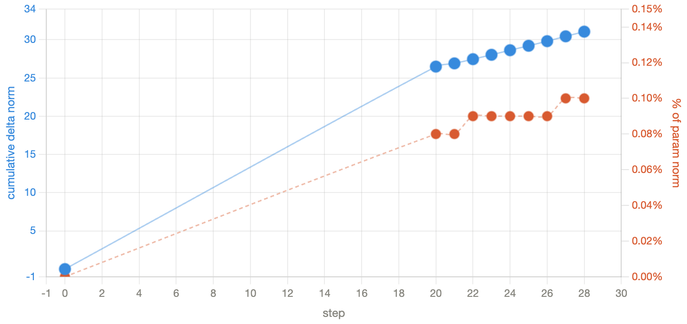

# cuda-rl

Reinforcement learning for CUDA kernel optimization using [KernelBench](https://github.com/ScalingIntelligence/KernelBench). Trains Qwen3-8B with multi-turn GRPO to generate custom CUDA kernels that outperform PyTorch's default implementations. Training and evaluation are run on [Modal](https://modal.com).

## Overview

The model is given a PyTorch `Model` class and must write a `ModelNew` class that implements the same operation using custom CUDA kernels — achieving higher throughput than the baseline PyTorch/cuBLAS implementation. After each attempt it receives feedback (compile errors, correctness failures, or the achieved speedup) and can iterate across up to 4 turns.

**Reward function:**
| Outcome | Reward |
|---|---|
| Format invalid / cheating detected | 0.0 |
| Code block present, doesn't compile | 0.01 |
| Compiles but incorrect | 0.02 |
| Correct, speedup ≤ 1× | 0.3 – 1.0 (linear) |
| Correct, speedup > 1× | speedup value (capped at 10×) |

## Method

- **Model:** Qwen3-8B with LoRA (rank 64, all projection layers)
- **Algorithm:** Multi-turn GRPO — 8 trajectories × 4 turns per problem, discounted returns (γ=0.4), per-turn advantage normalization
- **Training:** H200, constant temperature=0.45, LR=3e-5, reference-free (β=0.0)
- **Curriculum:** KernelBench Level 1 problems iterated in difficulty order (easiest → hardest)
- **Evaluation:** Modal-deployed KernelEvaluator on A100-80GB — isolated GPU containers for each kernel, 6 correctness trials + 40 performance trials

## Training Results (Steps 1–30)

30 steps completed, covering 30 of 55 Level 1 problems (~45–60 min per step on H200).

### Phase 1: Elementwise / Activation Ops (Steps 1–14)
Simple pointwise operations. Model solves these confidently on turn 1, with multi-turn recovery rarely needed.

| Step | Problem | T1 Correct | Any Correct | Mean Best | Max Best |
|------|---------|-----------|------------|----------|---------|
| 1 | ReLU | 6/8 | 8/8 | 0.904 | 0.957 |
| 2 | LeakyReLU | 7/8 | 7/8 | 0.760 | 0.953 |
| 3 | HardTanh | 7/8 | 7/8 | 0.835 | 0.966 |
| 4 | Tanh | 6/8 | 8/8 | 0.816 | 0.945 |
| 5 | Sigmoid | 6/8 | 7/8 | 0.746 | 0.936 |
| 6 | Softsign | 6/8 | 6/8 | 2.213 | **3.128** |
| 7 | Swish | 8/8 | 8/8 | 1.778 | 2.181 |
| 8 | SELU | 1/8 | 2/8 | 0.253 | 0.952 |
| 9 | Softplus | 8/8 | 8/8 | 0.886 | 0.947 |
| 10 | HardSigmoid | 0/8 | 0/8 | 0.020 | 0.020 |
| 11 | GELU | 2/8 | 4/8 | 0.470 | 0.946 |
| 12 | MinGPTNewGelu | 6/8 | 8/8 | **7.548** | **7.638** |
| 13 | Matrix scalar mul | 8/8 | 8/8 | 0.910 | 0.951 |
| 14 | Diagonal matmul | 8/8 | 8/8 | **10.000** | **10.000** |

Highlights: step 14 (diagonal matmul) hits the 10× cap — the model learns to recognize this as elementwise multiplication. Step 12 (MinGPT GELU polynomial approximation) achieves 7.55× mean speedup across trajectories.

### Phase 2: General Matmul (Steps 15–25)
GEMM problems where the baseline is cuBLAS. The model produces correct kernels but can't beat the highly optimized library — best rewards plateau around 0.4–0.5×.

| Step | Problem | T1 Correct | Any Correct | MT Recover | Max Best |
|------|---------|-----------|------------|-----------|---------|
| 15 | Matrix-vector mul | 0/8 | 0/8 | 0 | 0.020 |
| 16 | Tall-skinny matmul | 0/8 | 4/8 | 4 | 0.466 |
| 17 | Square matmul | 1/8 | 1/8 | 0 | 0.487 |
| 18 | Standard matmul | 0/8 | 1/8 | 1 | 0.484 |
| 19 | Small-K matmul | 2/8 | 4/8 | 2 | 0.476 |
| 20 | Symmetric matmul | 1/8 | 2/8 | 1 | 0.489 |
| 21 | Irregular matmul | 2/8 | 3/8 | 1 | 0.494 |
| 22 | 3D tensor matmul | 1/8 | 6/8 | 5 | 0.424 |
| 23 | Transposed matmul | 0/8 | 1/8 | 1 | 0.396 |
| 24 | Large-K matmul | 0/8 | 1/8 | 1 | 0.316 |
| 25 | 4D tensor matmul | 2/8 | 6/8 | 4 | 0.404 |

Multi-turn recovery becomes critical here — the model frequently fails on turn 1 but repairs compilation/correctness errors across turns. However, none of the correct kernels beat cuBLAS.

### Phase 3: Reductions (Steps 26–30)
Reduction operations where custom CUDA can realistically beat PyTorch. Multi-turn recovery surges (3–5 per step), and some trajectories begin exceeding 1× speedup.

| Step | Problem | T1 Correct | Any Correct | MT Recover | Max Best |
|------|---------|-----------|------------|-----------|---------|
| 26 | Sum reduction | 1/8 | 5/8 | 4 | 0.973 |
| 27 | Mean reduction | 1/8 | 6/8 | 5 | 0.970 |
| 28 | Max reduction | 0/8 | 3/8 | 3 | **1.077** |
| 29 | Min reduction | 2/8 | 4/8 | 2 | **1.111** |
| 30 | Argmax | 0/8 | 2/8 | 2 | 0.981 |

## LoRA Weight Analysis

After 24 steps, total relative weight change from base Qwen3-8B is **0.0009** — the model is in early-stage adaptation. Most-changed layers:

- Early MLP layers (0–5): `up_proj` and `gate_proj` change most, likely learning CUDA-specific syntax patterns
- Late attention layers (32–35): `k_proj` and `q_proj` disproportionately active, likely tracking long kernel structure
- `down_proj` layers systematically change ~3× less than `up_proj`/`gate_proj` across all depths



## Repository Structure

```
train/
  train_multiturn.py   # Main multi-turn GRPO training script
  train_grpo.py        # Earlier single-turn GRPO (reference)
  reward.py            # Modal-based reward function
  dataset.py           # KernelBench dataset loader with difficulty ordering
  test_reward.py       # End-to-end reward function test
analyze_checkpoint.py  # Per-layer LoRA weight delta analysis
sync_checkpoints.sh    # Download checkpoints from Modal volume
KernelBench/           # Submodule: ScalingIntelligence/KernelBench
kernelbench-tinker/    # Submodule: ScalingIntelligence/kernelbench-tinker
```

## Setup

```bash
# Install dependencies
pip install torch transformers trl peft accelerate wandb modal

# Deploy the kernel evaluator to Modal
cd kernelbench-tinker
modal deploy src/kernelbench_tinker/modal/app.py

# Create Modal secrets
modal secret create wandb-secret WANDB_API_KEY=...
modal secret create hf-secret HF_TOKEN=...

# Run training
modal run --detach train/train_multiturn.py
```
