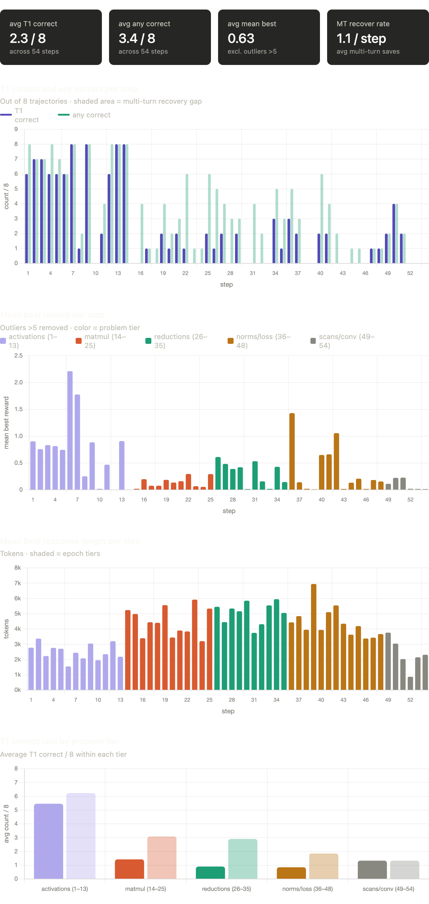
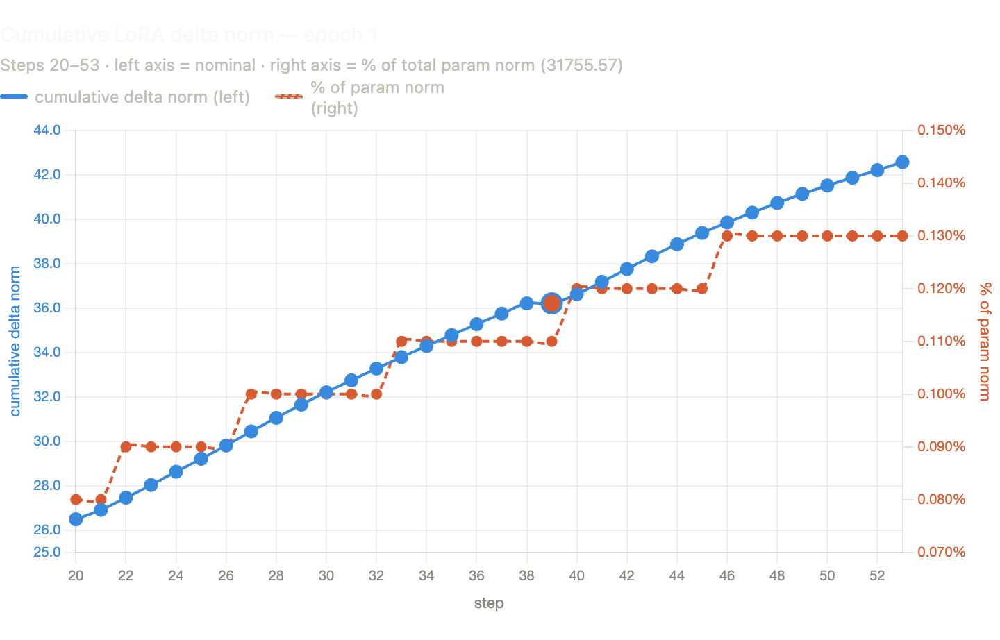
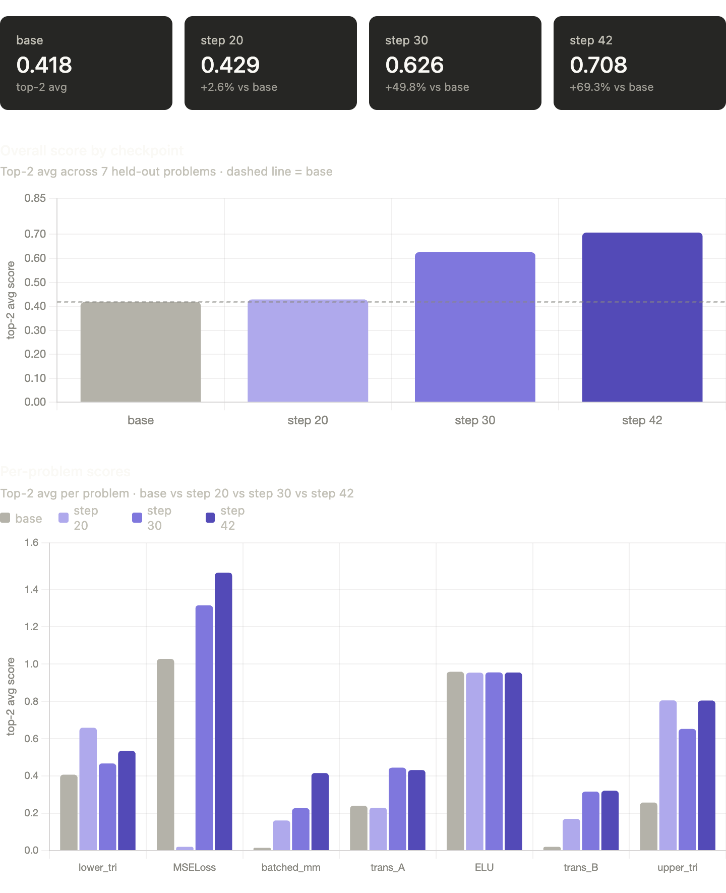

# cuda-rl

Reinforcement learning for CUDA kernel optimization using [KernelBench](https://github.com/ScalingIntelligence/KernelBench). Trains Qwen3-8B with multi-turn GRPO to generate custom CUDA kernels that outperform PyTorch's default implementations. Training and evaluation are run on [Modal](https://modal.com).

## Overview

The model is given a PyTorch `Model` class and must write a `ModelNew` class that implements the same operation using custom CUDA kernels — achieving higher throughput than the baseline PyTorch/cuBLAS implementation. After each attempt it receives feedback (compile errors, correctness failures, or the achieved speedup) and can iterate across up to 4 turns.

**Reward function:**
| Outcome | Reward |
|---|---|
| Format invalid / cheating detected / too long | 0.0 |
| Code block present, doesn't compile | 0.01 |
| Compiles but incorrect | 0.02 |
| Correct, speedup ≤ 1× | 0.3 – 1.0 (linear) |
| Correct, speedup > 1× | speedup value (capped at 10×) |

## Method

- **Model:** Qwen3-8B with LoRA (rank 64, all projection layers)
- **Algorithm:** Multi-turn GRPO — 8 trajectories × 4 turns per problem, discounted returns (γ=0.4), per-turn advantage normalization
- **Training:** Run on [Modal](https://modal.com) using H200 GPUs, LR=3e-5, reference-free (β=0.0)
- **Temperature:** I experimented with a variety of temperatures on the base Qwen3-8B model on one of the matrix multiplication prompts, and decided to go with a temperature of 0.45 seeing more stable kernels being generated at this temperature
- **Curriculum:** KernelBench Level 1 problems iterated in difficulty order (easiest → hardest)
- **Evaluation:** [Modal](https://modal.com)-deployed KernelEvaluator on A100-80GB — isolated GPU containers for each kernel, 6 correctness trials + 40 performance trials

## Training Results (Steps 1–54)

One full pass through all 54 Level 1 problems before switching to a new training run, after which I tried experimenting with a higher temperature and a slower learning rate to fine-tune the model further. After step 54, 3 consecutive stuck steps triggered a curriculum reset — the model restarted from the easiest problem (ReLU). You can see detailed per-prompt results at the bottom of this page.



The **tier breakdown** (bottom chart) tells the clearest story - activations are by far the easiest tier. The gap between T1 correct (solid) and any correct (faded) in each tier shows how much multi-turn recovery is contributing. It's most valuable in the matmul and reduction tiers. **Response length** tracks difficulty well - the model uses 1500-3000 tokens on simple activations, and 4000-6000 tokens as the difficulty increases. The drop-off at the end of the chart shows **thinking collapse** where the model learned to suppress `<think>` blocks because shorter completions reduced variance without hurting reward much. I later ran a v2 training run to further fine-tune the model with a sigmoid thinking length penalty: `thinking_multiplier = 1 / (1 + exp(-N_tokens / 256))`, which applies a 0.5× multiplier at zero thinking tokens and approaches 1.0 above ~1024 tokens.

## LoRA Weight Analysis

After 54 steps, total relative weight change from base Qwen3-8B is **0.0013** — the model is in early-stage adaptation. Most-changed layers:

- Early MLP layers (0–5): `up_proj` and `gate_proj` change most, likely learning CUDA-specific syntax patterns
- Late attention layers (32–35): `k_proj` and `q_proj` disproportionately active, likely tracking long kernel structure
- `down_proj` layers systematically change ~3× less than `up_proj`/`gate_proj` across all depths
- The slope is remarkably consistent at ~0.52-0.58 per step throughout the epoch, with only very slight deceleration toward the end
- The percentage scale shows the model drifted from 0.08% to 0.13% of the total parameter norm, small given LoRA's low-rank constraint



## Evaluation

I evaluate how well the model performs on a held-out test set of 7 problems from Kernelbench Level 1 at various checkpoints. For multi-turn evaluation, I spin up 8 trajectories for each prompt, each with 4 turns. Each trajectory is scored based on the max reward any of its turns is able to generate. The per-prompt score is the mean of the top 2 trajectories for that prompt. All evaluations were run with a temperature of 0.45. The matrix multiplication problems all show consistent monotonic improvement across checkpoints. ELU is essentially saturated at all checkpoints - the model already knew how to write elementwise activation kernels before training began.



## Repository Structure

```
train/
  train_multiturn.py   # Main multi-turn GRPO training script
  train_grpo.py        # Earlier single-turn GRPO (reference)
  reward.py            # Modal-based reward function
  dataset.py           # KernelBench dataset loader with difficulty ordering
  test_reward.py       # End-to-end reward function test
analyze_checkpoint.py  # Per-layer LoRA weight delta analysis
sync_checkpoints.sh    # Download checkpoints from Modal volume
KernelBench/           # Submodule: ScalingIntelligence/KernelBench
kernelbench-tinker/    # Submodule: ScalingIntelligence/kernelbench-tinker
```

## Setup

```bash
# Install dependencies
pip install torch transformers trl peft accelerate wandb modal

# Deploy the kernel evaluator to Modal
cd kernelbench-tinker
modal deploy src/kernelbench_tinker/modal/app.py

# Create Modal secrets
modal secret create wandb-secret WANDB_API_KEY=...
modal secret create hf-secret HF_TOKEN=...

# Run training
modal run --detach train/train_multiturn.py
```

## Detailed epoch 1 results

### Phase 1: Elementwise / Activation Ops (Steps 1–14)
Simple pointwise operations. Model solves these confidently on turn 1, with multi-turn recovery rarely needed.

| Step | Problem | T1 Correct | Any Correct | MT Recover | Mean Best | Max Best |
|------|---------|-----------|------------|-----------|----------|---------|
| 1 | ReLU | 6/8 | 8/8 | 2 | 0.904 | 0.957 |
| 2 | LeakyReLU | 7/8 | 7/8 | 0 | 0.760 | 0.953 |
| 3 | HardTanh | 7/8 | 7/8 | 0 | 0.835 | 0.966 |
| 4 | Tanh | 6/8 | 8/8 | 2 | 0.816 | 0.945 |
| 5 | Sigmoid | 6/8 | 7/8 | 1 | 0.746 | 0.936 |
| 6 | Softsign | 6/8 | 6/8 | 0 | 2.213 | **3.128** |
| 7 | Swish | 8/8 | 8/8 | 0 | 1.778 | 2.181 |
| 8 | SELU | 1/8 | 2/8 | 1 | 0.253 | 0.952 |
| 9 | Softplus | 8/8 | 8/8 | 0 | 0.886 | 0.947 |
| 10 | HardSigmoid | 0/8 | 0/8 | 0 | 0.020 | 0.020 |
| 11 | GELU | 2/8 | 4/8 | 2 | 0.470 | 0.946 |
| 12 | MinGPTNewGelu | 6/8 | 8/8 | 2 | **7.548** | **7.638** |
| 13 | Matrix scalar mul | 8/8 | 8/8 | 0 | 0.910 | 0.951 |
| 14 | Diagonal matmul | 8/8 | 8/8 | 0 | **10.000** | **10.000** |

Highlights: step 14 (diagonal matmul) hits the 10× cap — the model learns to recognize this as elementwise multiplication rather than a full GEMM. Step 12 (MinGPT GELU) achieves 7.55× mean speedup by fusing ~5 PyTorch kernel launches into one. Step 36 (Softmax, below) also hits the cap.

### Phase 2: General Matmul (Steps 15–25)
GEMM problems where the baseline is cuBLAS. The model produces correct kernels but can't beat the highly optimized library — best rewards plateau around 0.4–0.5×.

| Step | Problem | T1 Correct | Any Correct | MT Recover | Mean Best | Max Best |
|------|---------|-----------|------------|-----------|----------|---------|
| 15 | Matrix-vector mul | 0/8 | 0/8 | 0 | 0.020 | 0.020 |
| 16 | Tall-skinny matmul | 0/8 | 4/8 | 4 | 0.199 | 0.466 |
| 17 | Square matmul | 1/8 | 1/8 | 0 | 0.076 | 0.487 |
| 18 | Standard matmul | 0/8 | 1/8 | 1 | 0.077 | 0.484 |
| 19 | Small-K matmul | 2/8 | 4/8 | 2 | 0.186 | 0.476 |
| 20 | Symmetric matmul | 1/8 | 2/8 | 1 | 0.136 | 0.489 |
| 21 | Irregular matmul | 2/8 | 3/8 | 1 | 0.161 | 0.494 |
| 22 | 3D tensor matmul | 1/8 | 6/8 | 5 | 0.296 | 0.424 |
| 23 | Transposed-both matmul | 0/8 | 1/8 | 1 | 0.068 | 0.424 |
| 24 | Large-K matmul | 0/8 | 1/8 | 1 | 0.056 | 0.316 |
| 25 | 4D tensor matmul | 2/8 | 6/8 | 4 | 0.293 | 0.402 |

Multi-turn recovery becomes critical here — the model frequently fails on turn 1 but repairs compilation/correctness errors across turns. None of the correct kernels beat cuBLAS.

### Phase 3: Reductions (Steps 26–31)
Reduction operations where custom CUDA can realistically beat PyTorch. Some trajectories exceed 1× speedup for the first time.

| Step | Problem | T1 Correct | Any Correct | MT Recover | Mean Best | Max Best |
|------|---------|-----------|------------|-----------|----------|---------|
| 26 | Sum reduction | 1/8 | 5/8 | 4 | 0.612 | 0.971 |
| 27 | Mean reduction | 2/8 | 4/8 | 2 | 0.483 | 0.972 |
| 28 | Max reduction | 0/8 | 3/8 | 3 | 0.390 | **1.071** |
| 29 | Min reduction | 2/8 | 3/8 | 1 | 0.421 | **1.122** |
| 30 | Argmax | 0/8 | 0/8 | 0 | 0.014 | 0.020 |
| 31 | Argmin | 0/8 | 4/8 | 4 | 0.534 | **1.089** |

### Phase 4: Norms and Losses (Steps 32–44)
Normalization layers and loss functions — a mix of multi-pass reductions, numerically sensitive ops, and PyTorch-optimized fused kernels. Model struggles significantly except for a few outliers.

| Step | Problem | T1 Correct | Any Correct | MT Recover | Mean Best | Max Best |
|------|---------|-----------|------------|-----------|----------|---------|
| 32 | HuberLoss | 0/8 | 2/8 | 2 | 0.158 | 0.762 |
| 33 | L1Norm | 0/8 | 0/8 | 0 | 0.018 | 0.020 |
| 34 | FrobeniusNorm | 3/8 | 5/8 | 2 | 0.429 | 0.734 |
| 35 | L2Norm | 1/8 | 3/8 | 2 | 0.146 | 0.389 |
| 36 | Softmax | 3/8 | 5/8 | 2 | 1.430 | **10.000** |
| 37 | LogSoftmax | 2/8 | 3/8 | 1 | 0.142 | 0.373 |
| 38 | KLDivLoss | 0/8 | 0/8 | 0 | 0.020 | 0.020 |
| 39 | CrossEntropyLoss | 0/8 | 0/8 | 0 | 0.010 | 0.010 |
| 40 | TripletMarginLoss | 2/8 | 6/8 | 4 | 0.650 | 0.891 |
| 41 | RMSNorm | 2/8 | 4/8 | 2 | 0.662 | 1.631 |
| 42 | LayerNorm | 0/8 | 2/8 | 2 | 1.057 | **7.417** |
| 43 | InstanceNorm | 0/8 | 0/8 | 0 | 0.016 | 0.020 |
| 44 | BatchNorm | 0/8 | 1/8 | 1 | 0.134 | 0.955 |

Step 36 (Softmax) is a major outlier — one trajectory hits the 10× cap, likely exploiting the online softmax trick (single-pass max+sum+normalize). Step 42 (LayerNorm) similarly sees one trajectory reach 7.4× by fusing the two-pass reduction. Step 39 (CrossEntropyLoss) was the hardest problem of the phase: log softmax combined with NLL loss requires a max reduction, a sum reduction, and a scalar output per row — PyTorch's implementation is already highly fused.

### Phase 5: Spatial Pooling (Steps 45–48)
Pooling operations with non-trivial output size formulas. Correct kernels occasionally beat PyTorch with custom memory access patterns, but T1 accuracy is low.

| Step | Problem | T1 Correct | Any Correct | MT Recover | Mean Best | Max Best |
|------|---------|-----------|------------|-----------|----------|---------|
| 45 | Max Pool 1D | 0/8 | 1/8 | 1 | 0.208 | **1.546** |
| 46 | Avg Pool 2D | 0/8 | 0/8 | 0 | 0.016 | 0.020 |
| 47 | Max Pool 2D | 1/8 | 1/8 | 0 | 0.184 | **1.355** |
| 48 | Max Pool 3D | 1/8 | 1/8 | 0 | 0.156 | **1.139** |

### Phase 6: Sequential Scans (Steps 49–52)
Cumulative operations that are inherently hard to parallelize. The model's CUDA kernels are correct but can't overcome PyTorch's highly tuned implementations.

| Step | Problem | T1 Correct | Any Correct | MT Recover | Mean Best | Max Best |
|------|---------|-----------|------------|-----------|----------|---------|
| 49 | cumsum | 2/8 | 2/8 | 0 | 0.112 | 0.415 |
| 50 | cumprod | 4/8 | 4/8 | 0 | 0.223 | 0.462 |
| 51 | cumsum reverse | 2/8 | 2/8 | 0 | 0.228 | 1.000 |
| 52 | masked cumsum | 0/8 | 0/8 | 0 | 0.019 | 0.020 |

### Phase 7: Convolutions and Curriculum Reset (Steps 53–54)
3D convolutions — the hardest problems in the curriculum. Two consecutive stuck steps combined with the prior stuck step from step 52 triggered a curriculum reset after step 54.

| Step | Problem | T1 Correct | Any Correct | MT Recover | Mean Best | Max Best |
|------|---------|-----------|------------|-----------|----------|---------|
| 53 | 3D conv (square) | 0/8 | 0/8 | 0 | 0.016 | 0.020 |
| 54 | 3D conv (asymmetric) | 0/8 | 0/8 | 0 | 0.014 | 0.020 |